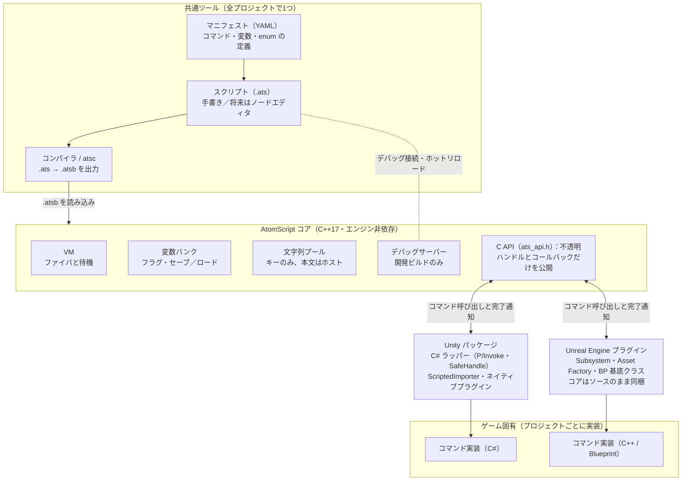
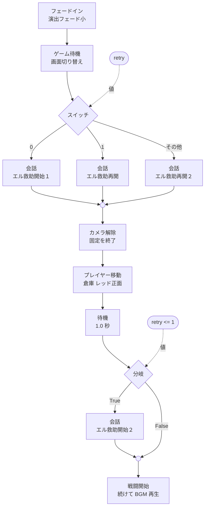
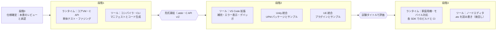

# AtomScript 仕様書（ドラフト）

> この文書は Claude Docs の「AtomScript 仕様書（ドラフト）」から書き出したもの（2026-10-07 時点）。図は Mermaid で描き直している。

Oct 6, 2026 · @はぎはら

## 1. 概要

LT（DS）のスクリプトマネージャ（scriptman / scriptmanext）を参考に、**エンジン非依存の C++ コアVM** と **全プロジェクト共通のスクリプト作成ツール** からなるスクリプトシステムを新規に設計する。名称は **AtomScript**（API 接頭辞 `ats_`、テキスト `.ats`、バイナリ `.atsb`、CLI `atsc`）とする。Unity と Unreal Engine の両方で、PC・家庭用ゲーム機（PS5、Xbox Series X|S、Nintendo Switch、Nintendo Switch 2）・iOS・Android に対応する。

### 目的

- イベント・進行管理・演出制御のスクリプト基盤を、タイトルごとに作り直さず使い回す
- コア（言語と実行系）とゲーム固有処理（コマンドの中身）の境界を、C ABI とコマンド登録で強制的に分ける
- プランナーがプログラマーを介さずにイベントを組めるツールを、全プロジェクトで共有する（当面はテキスト形式、最終的にはノード型エディタ）

### スコープ

- コアVM（実行・変数・待機・セーブ）と C API
- コンパイラ（テキスト → バイトコード）と CLI
- コマンド定義スキーマ（マニフェスト）と、そこからのコード生成
- Unity パッケージ、Unreal Engine プラグイン
- テキスト形式（.ats）と編集支援、デバッガ、ホットリロード。ノードエディタは後の段階

### 非スコープ

- 汎用プログラミング言語にすること（クラス、任意の配列操作、文字列処理などは持たない）
- 当たり判定・UI・サウンドなどの実装（ホストのコマンドとして実装する）
- LT の既存スクリプト資産との互換（ロジックの参考のみ）

### 設計方針

1. **コアはゲームを知らない。** コマンドは番号ではなく名前で登録し、実装はすべてホスト側に置く。
2. **境界は C ABI。** 例外・STL・RTTI を DLL 境界の外に出さない。どのコンパイラ・言語からも呼べる。
3. **定義は1か所。** コマンド・変数・enum はマニフェストにだけ書き、エディタ補完・コンパイラ・ハンドラ雛形はそこから生成する。
4. **中断と再開が前提。** 何フレームもかかる処理、非同期完了、セーブとロードを最初から仕様に含める。
5. **メモリとCPUはホストが握る。** アロケータとログはホストから受け取り、1フレームの命令数に上限を設ける。

## 2. 全体アーキテクチャ

共通部分は「ツール」「コア」「エンジン統合」の3層で、ゲームごとに書くのは最下層のコマンド実装とマニフェストだけになる。



コアとゲームの間は必ず C API を通る。コアがゲームの型やエンジンの型を参照することはない。

## 3. コアとゲーム依存部分の責務分割

判断基準は「別のゲームでもそのまま使えるか」。使えるものだけをコアに入れ、意味を持つものはすべてホストのコマンドかマニフェストに出す。

| 機能 | LT での所在 | 新設計での所在 | 備考 |
| --- | --- | --- | --- |
| 制御構文（IF / SWITCH / AND / OR / NOT） | scriptman.cpp `ccScript::Ctrl` | コア | ノードでは Branch / Switch ノードになる |
| 演算子（代入・比較・ビット演算） | scriptman.cpp `CalcOperator` など | コア |  |
| 実行キューと待機（WAIT / NEXT） | scriptman.cpp `ExeQueue` | コア | ファイバ単位の中断と非同期完了に拡張（§6） |
| フラグテーブル（グループ・ビット幅） | scriptman.cpp `ccFlgTbl` | コア（変数バンク） | どんな変数があるかはマニフェストで定義 |
| システムワーク `g_SystemWork[]` | scriptman.cpp / ext | コア（変数バンク）＋ホスト | 入れ物はコア、各項目の意味と更新はホスト |
| セーブ用の書き出し・読み込み | `ccFlgTbl::_WriteToMem` など | コア | 安定IDで互換を保つ（§6） |
| 文字列テーブル | scriptman.cpp `ccStrTbl` | コア（文字列プールとキーのみ） | 表示文字列の実体とローカライズはホスト |
| デバッグトレース | `scpPrintf` | コア | デバッグサーバー経由でエディタに表示 |
| スクリプトの読み込み（ファイル I/O） | `ccResourceLoad` 継承 | ホスト | コアはメモリ上のバイト列を受け取るだけ |
| イベントポイントの当たり判定 | `ccEventPointCtrl` | ホスト | コアは「イベントを発火する」API のみ |
| 各コマンド（カメラ、メッセージ、オブジェクト、サウンド…） | scriptmanext.cpp | ホスト | マニフェストで宣言し、ハンドラを登録 |
| 条件の問い合わせ（特殊条件 `EIF_*` など） | scriptmanext.cpp | ホスト | 値を返す「クエリ」として登録 |
| 定数・enum（`scriptdef.h`） | 定義.xls から生成 | マニフェスト | プロジェクトごとに用意 |

## 4. スクリプトモデルとテキスト形式

スクリプトは「イベントを起点に、実行の流れと値をつなぐグラフ」とする。**正となる表現はテキストの中間ファイル `.ats`** で、当面はこれを手で書く。ノードエディタは後の段階で作り、同じ `.ats` を読み書きするだけにする。コンパイラの入力は常に `.ats` で、CLI がバイナリ `.atsb` に変換する。

### 構造

- **スクリプトファイル**（`.ats`、UTF-8 テキスト）：1ファイル＝1スクリプト。複数のイベント入口と、内部関数を持てる。
- **実行の流れ**：テキストでは文の並びと `if` / `switch` などのブロック。ノードでは実行ピン。
- **値**：テキストでは式。ノードではデータピンと、実行ピンを持たない純粋ノード（演算・問い合わせ）。
- **流れは構造化された形に限る**：分岐は必ずブロックの終わりで合流し、任意の場所へのジャンプ（goto）は持たない。テキストとノードを相互に変換できるようにするための制約で、ノードエディタもこの形しか作れないようにする。

### テキスト形式（`.ats`）

```
script "sample/merchant"            // スクリプトID（セーブデータのキー）

var talked: int = 0                  // スクリプト変数（このファイル内だけ。セーブ対象）

// 商人に話しかけたとき
event OnTalk(target: handle) {
    talked += 1
    if (story.chapter >= 3 && !IsQuestCleared(12)) {
        await ShowMessage("例の品は手に入ったかい？", face: Face.Smile)
        CameraShake(power: 2.0, duration: 0.5)
        story.met_merchant = true
    } else {
        await ShowMessage("また来てくれ。")
    }

    loop {
        let answer = await SelectWindow(SelectType.YesNo)   // ローカル変数
        if (answer == 0) { break }
        await ShowMessage("本当に？")
    }

    parallel {
        branch { await FadeOut(0.5) }
        branch { await PlayBgm("bgm_shop") }
    }
    wait 1.5
    GiveReward(target)
}

fn GiveReward(target: handle) {
    scene.reward_count += 1
}
```

- ファイルの先頭に `script "<ID>"` を1つ書く。ID はセーブデータのキーになるので、一度決めたら変えない。ファイルを移動・改名しても ID が同じならセーブは引き継げる。重複はコンパイラが全ファイルを見てエラーにする。当面は手で書き、ノードエディタ移行後は新規作成時にエディタが振る。
- 文法は C 系の最小限：`script`、`var` / `transient var` / `let`、`event`、`fn`、`if` / `else`、`switch` / `case` / `default`、`loop` / `loop (回数)`、`break` / `continue`、`parallel` / `race` / `branch`、`wait`、`await`、`fire`、`return`、`reset vars`。
- 変数は3種類：マニフェストの共有変数（`story.chapter` のようにバンク名付き）、ファイル先頭の `var`（スクリプト変数）、ブロック内の `let`（ローカル変数）。詳細は§6。
- `fire EventName(引数)` で別スクリプトのイベントを発火する。呼び出し元は待たずに次へ進む。
- コマンド・クエリ・共有変数・enum の名前はマニフェストから解決する。引数は位置指定と名前指定の両方を使える。
- 待機ありのコマンドには `await` を付ける。付け忘れや、即時コマンドへの付け間違いはコンパイルエラーにする（どこで止まるかをテキスト上で見えるようにするため）。
- 各文には `@node("n0012")` のような注釈で永続 ID を付けられる。手書きでは省略でき、ノードエディタが保存時に付ける。デバッガのブレーク位置とホットリロード時の対応付けに使う（ID がない文は行番号で代用する）。
- ノードの配置座標などエディタだけが使う情報は別ファイル（`.ats.layout`）に置き、`.ats` には入れない。
- 文字列は UTF-8 でそのまま書ける。翻訳用の抽出は CLI で行う（§11）。

### 文法の補足（atsc の実装で確定）

- **待機**：`wait 秒数`、`wait frames フレーム数`、`yield`（次のフレームまで）。
- **switch**：`case 値 { … }` と `default { … }` で書く。フォールスルーはしない。case の値は定数（int か enum の値）で、重複するとエラー。
- **関数の戻り値**：`fn F(x: int) -> int { … }` と書く。値を返す関数で `return` が抜ける経路があればエラー。
- **await**：待機ありのコマンドに加えて、待機を含む関数（間接的に含むものも）の呼び出しにも必要。待機しないものに付けるとエラー。
- **組み込み関数**：`int()`、`float()`、`rand(n)`、`min()`、`max()`、`abs()`。
- **loop**：`loop { … }` に待機も `break` もなければエラー。`loop (n) { … }` は回数指定。
- **演算**：`&&` と `||` は短絡評価。int と float の演算では int を float に昇格する。文字列は `==` と `!=` だけ。

詳細はリポジトリの `docs/language.md`。

### goto を持たない理由

書く側の言語に goto はないが、バイトコードには `JMP` / `JZ` があり、if や loop はコンパイラがジャンプに変換する（LT と同じ）。

1. **テキストとノードを往復変換できなくなる。** 任意の配線をブロック構文に戻すには、処理の複製かフラグ変数の自動追加が要る。配線1本の変更でテキストの広い範囲が書き換わり、Git の差分・マージと「文＝ノード」の対応（`@node`）が崩れる。
2. **値が未定義の状態を作れてしまう。** 通らなかった経路で計算される値を使う箇所へ飛び込める。ブロック構造ならスコープでコンパイル時にエラーにできる。
3. **並行・待機・セーブと噛み合わない。** `parallel` への飛び込みや飛び出しで合流待ちの数が決まらなくなる。`await` 中の位置を「どのブロックの何回目か」で一意に表せなくなり、セーブとホットリロードの土台が崩れる。
4. **検証とエラー表示が難しくなる。** 待機のない無限ループなどを、直すべき行として示せなくなる。

| goto を使いたくなる場面 | 代わりの書き方 |
| --- | --- |
| 「いいえ」なら質問に戻る | `loop { … if (答え == はい) { break } }` |
| 途中で処理を打ち切る | `return`、ループ内なら `break` |
| 同じ処理を複数の場所から使う | `fn` に切り出す |
| 状態遷移（A → B → A …） | `loop` と `switch (state)`、またはイベントを分ける |
| 別のスクリプトに処理を移す | `fire` でイベントを発火 |

ノードエディタでも、分岐後の合流とループノードは自由に使える。「後ろ向きの配線」と「別のブロックの途中への配線」だけを、接続できないようにする。

### ノード種別

| 種別 | 例 | 提供元 | LT での対応 |
| --- | --- | --- | --- |
| イベント | OnStart、OnTrigger(id)、OnTalk(target)、カスタムイベント | コア＋マニフェスト | スクリプト起動、イベントポイント |
| フロー制御 | Branch、Switch、Sequence、DoOnce、Loop（回数上限付き） | コア | IF / SWITCH |
| 並行 | Fork、Join、Race（どれか1つが終わったら進む） | コア | なし（新規） |
| 待機 | WaitSeconds、WaitFrames、WaitUntil(条件) | コア | GameWait など |
| 変数 | Get / Set（変数バンク単位） | コア＋マニフェスト | フラグ、システムワーク |
| 演算 | 算術、比較、論理、ビット演算、乱数 | コア | 演算子、EEC\_RANDOM |
| コマンド | ShowMessage、CameraShake、PlayBgm | マニフェスト（ホスト実装） | EEC\_\* |
| クエリ | IsQuestCleared、GetPlayerState | マニフェスト（ホスト実装） | ECC\_\* / EIF\_\* |
| 関数呼び出し | 同じグラフ内・別グラフのサブグラフ | コア | なし（新規） |
| 注釈 | コメント、グループ枠、リルート | エディタのみ | なし |

### 型

`bool`、`int`（32bit）、`float`（32bit）、`string`（文字列プールのキー。内容は変更できない）、`enum`（マニフェスト定義）、`handle`（ホストが意味を決める64bit値。アクター参照など）の6種。ベクトルなどの構造体型は未決（§14）。

### 待機を伴うコマンド

- マニフェストで「即時」か「待機あり」を宣言する。待機ありのコマンドは、ホストが完了を通知してから出力の実行ピンが流れる。
- 待機ありのコマンドは「Completed」に加えて「Failed」「Cancelled」の出力ピンを任意で持てる。
- メッセージの選択肢のように結果で分岐するものは、戻り値を Switch につなぐ。LT の `EEC_SELECTWINDOW` による中断は、この仕組みで置き換える。

### コンパイル時の検証

- 型が合わないピンの接続、未接続の必須入力
- データピンの循環
- 待機も回数上限もないループ
- マニフェストに存在しないコマンド・変数・enum 値への参照
- 到達しないノード（警告）

## 5. 中間表現とバイトコード形式

コンパイラは `.ats`（テキスト）を構文解析・検証して中間表現に変換し、スタック型VM用のバイトコード `.atsb` を出力する。LT と同じくジャンプ先はコンパイル時に解決し、実行時に構文解析はしない。LT と違う点は、ゲーム固有のコマンド番号を命令セットに埋め込まず、名前の対応表で読み込み時に解決すること。

### ファイル構造（`.atsb`、リトルエンディアン、4バイト境界）

| セクション | 内容 |
| --- | --- |
| Header | マジック `ATSB`、スクリプトID、形式バージョン（major / minor）、フラグ、マニフェストのハッシュ、セクション数 |
| Section Table | 各セクションのタグ・オフセット・サイズ。未知のタグは読み飛ばす |
| STRS | 文字列プール（UTF-8） |
| CNST | 定数プール（float、handle など） |
| IMPT | インポート表：使うコマンド・クエリの名前と引数シグネチャのハッシュ |
| VARS | 参照する変数バンクと変数の安定ID、スクリプト変数の宣言（名前・型・初期値・保存の有無・旧名） |
| ENTR | エントリ表：イベント名 → コード位置、関数表 |
| CODE | 命令列 |
| DBUG | 任意：命令位置 → ノードID の対応、ローカル名。製品ビルドでは削除できる |

### 命令セット（概要）

命令は 8bit のオペコード＋固定長のオペランド。スタックの1要素は **64bit** で、int・bool・enum は下位32bit、float はビット列、string は VM 内の文字列 ID、handle は64bit全体を使う（実装時に 32bit＋handle 2要素から変更。実装が単純になり、取り違えの余地がなくなるため）。命令ごとの詳細はリポジトリの `docs/bytecode.md`。

| グループ | 命令例 |
| --- | --- |
| 定数・スタック | `PUSH_I`、`PUSH_F`、`PUSH_K`（定数プール）、`POP`、`DUP` |
| ローカル・変数 | `LD_LOCAL`、`ST_LOCAL`、`LD_VAR`、`ST_VAR`（バンク＋変数ID） |
| 演算 | `ADD` `SUB` `MUL` `DIV` `MOD` `NEG`、`AND` `OR` `XOR` `SHL` `SHR`、`EQ` `NE` `LT` `LE`、`NOT`、型変換 |
| 分岐 | `JMP`、`JZ`、`JNZ`、`SWITCH`（ジャンプ表） |
| 呼び出し | `CALL_CMD`（インポート番号、引数数。中断しうる）、`CALL_QUERY`、`CALL_FN`、`RET` |
| 並行・待機 | `FORK`、`JOIN`、`RACE`、`YIELD`、`SLEEP`、`END` |

### バージョン管理

- **major 不一致**：読み込みを拒否する。
- **minor が新しい**：未知のセクションを無視して読めるようにする。
- **インポート解決の失敗**（未登録のコマンド、シグネチャ不一致）：読み込みエラーにし、足りない名前をすべて列挙する。
- **マニフェストのハッシュ不一致**：開発ビルドでは警告、製品ビルドではエラー（設定で切り替えられる）。
- 読み込み時にバイトコードを検証する：ジャンプ先、スタック深さ、インデックスの範囲。壊れたデータでメモリを壊さない。

## 6. VM 実行モデル

VM はインスタンス単位で状態を持ち、ホストが毎フレーム `ats_vm_update()` を呼ぶと、動けるファイバを順に実行する。LT の static な共有キューは廃止し、ファイバごとに中断する方式にする。

### オブジェクトの階層

| オブジェクト | 寿命 | 持つもの |
| --- | --- | --- |
| `ats_runtime` | アプリ全体で1つ | アロケータ、ログ、コマンド・クエリの登録表。初期化後は変更しない |
| `ats_program` | バイトコードの読み込み単位 | 検証済みのコードと解決済みのインポート。読み取り専用で、複数の VM から共有できる |
| `ats_vm` | ゲームセッションやシーンなど、ホストが決める | 変数バンク、実行中のファイバ、乱数状態 |
| `ats_fiber` | イベント発火または Fork から終了まで | 命令位置、スタック、ローカル変数、状態 |

### ファイバの状態

- **Ready**：次の update で実行される。
- **Suspended**：待機ありコマンドの完了待ち。
- **Sleeping**：時間またはフレーム数の待機中。
- **Done / Aborted**：終了。Aborted のときは、待機中のコマンドにキャンセルを通知する。

1回の update で実行する命令数には上限を設ける（設定可）。上限を超えたファイバは次フレームに回し、開発ビルドでは警告を出す。

### コマンド呼び出しの取り決め

ハンドラは引数を受け取り、次のいずれかを返す。

| 戻り値 | 意味 | 向いている用途 |
| --- | --- | --- |
| `ATS_DONE` | その場で完了。結果を書き込んで次の命令へ | フラグ設定、効果音の再生 |
| `ATS_PENDING` | 待機。ホストが後で `ats_call_complete(token)` を呼ぶ | UE の Latent Action、Unity の async |
| `ATS_RUNNING` | 待機。次の update で同じハンドラをもう一度呼ぶ | フェード完了の待ちなど。LT の WAIT と同じ動き |
| `ATS_FAIL` | 失敗。Failed ピンがあればそちらへ、なければファイバを中断 |  |

**チャンネル（直列化）**：マニフェストでコマンドに `channel: message` のようなチャンネルを指定すると、別のファイバからの同じチャンネルのコマンドは先着順に1つずつ実行される。LT の共有キューが担っていた「演出が重ならない」性質を、必要なところだけに残す。

### 変数バンク

- マニフェストでバンクと変数を宣言する。変数ごとに型、ビット幅（bool は1bitに詰める）、初期値、**安定ID**を持つ。
- バンクのスコープは `persistent`（セーブ対象）、`session`（セーブしない）、`fiber`（ファイバ内ローカル）の3種。
- ホストも C API 経由で読み書きできる。変数の変更を監視するコールバックも登録できる。

### スクリプト変数

スクリプト変数は `.ats` の先頭で `var` 宣言する、そのファイルの中だけで使える変数。他のスクリプトやゲームと共有する値は変数バンク（マニフェスト）に、そのスクリプトの進行管理にしか使わない値はスクリプト変数に置く。LT の `LOCAL1`・`GLOBAL1`・イベントワークのような汎用スロットは、名前付きのスクリプト変数に置き換える。

| 種類 | 書く場所 | 見える範囲 | 寿命 | セーブ |
| --- | --- | --- | --- | --- |
| 共有変数（変数バンク） | マニフェスト | 全スクリプトとゲーム側 | ゲーム全体 | バンクの `scope` による |
| スクリプト変数 `var` | `.ats` の先頭 | そのファイルだけ | 初めて読み込まれてから、リセットされるまで | 対象（`transient var` は対象外） |
| ローカル変数 `let` | イベント・関数の中 | そのブロックだけ | そのファイバが終わるまで | 対象外 |

- **確保と初期化**：VM 内で、そのスクリプトを最初に読み込んだときに1回だけ確保し、初期値を入れる。同じスクリプトの別のイベントは同じ変数を共有する。
- **プログラムを外したとき**：ブロックを出て `ats_program` を解放しても値は VM に残り、再読み込み時は前回の値から再開する。
- **リセット**：スクリプト内の `reset vars` で、そのファイルの `var` をすべて初期値に戻す。ゲーム側からは `ats_script_reset()` で戻す（ニューゲーム、クエスト破棄など）。
- **セーブしない値**：演出中だけの一時的な値は `transient var` と書く。指定しなければ保存対象とし、書き忘れたときに保存される側に倒す。
- **外からの参照**：他のスクリプトからは参照できない（コンパイルエラー）。ゲーム側の通常の API からも触れず、デバッガとテスト用 API からだけ読み書きできる。

セーブデータには「スクリプトID ＋ 変数名 ＋ 型 ＋ 値」の組で書き出す。enum は数値ではなく値の名前で保存する。

```
golden_lore/el_rescue : rank   : enum Rank : Warehouse
golden_lore/el_rescue : retry  : int       : 2
golden_lore/el_rescue : killed : int       : 1
```

読み込み時点でメモリにないスクリプトの値は、VM が休眠中のデータとして保持し、そのスクリプトが読み込まれたときに適用する。次のセーブでもそのまま書き出すので、ブロックごとにスクリプトを入れ替える作りでも値は失われない。

発売後の更新で変数を変えたときは、古いセーブデータを次のように読む。

| 変更 | 古いセーブを読んだときの動き |
| --- | --- |
| 変数を追加 | 初期値で始まる |
| 変数を削除 | セーブ内の値を無視し、ログに警告を出す |
| 名前を変更 | `@was("retry_count") var retry: int = 0` で旧名から引き継ぐ |
| 型を変更 | 変換できれば変換し、できなければ初期値にして警告 |
| enum の値を削除 | 初期値にして警告 |

### セーブとロード

- `persistent` バンクは「安定ID → 値」、スクリプト変数は「スクリプトID＋変数名 → 値」の形で書き出す。変数の追加・削除・並べ替えがあっても、古いセーブデータを読める（LT の `_WriteFromMem` にあった個別対応を不要にする）。
- **実行中のファイバは保存しない。** セーブデータに入るのは、変数（`persistent` バンクとスクリプト変数）と乱数の状態だけ。ロード後はファイバが1本もない状態から始まる。ゲーム側がいつもどおりイベント（`OnBlockEnter` など）を発火し、スクリプトは変数（`rank` など）を見てどこから始めるかを判断する。LT のイベントランクと同じ考え方。
- 保存しない理由：途中の位置から再開すると、たとえば `await ShowMessage(…)` の後の `wait 1.5` の最中に保存された場合、ロード後にメッセージを見直せない。演出の途中から始まるより、区切りのよい場所からやり直す方がプレイヤーにとって自然で、実装も単純になる。
- **書き方の決まり**：進行を表す変数は、演出の区切りが終わってから更新する（例：会話とフェードが終わってから `rank = Rank.Lab`）。区切りの途中で保存されても、ロード後はその区切りの先頭からやり直しになる。
- セーブはいつでも呼べる。ただし、実行中のファイバが途中まで書き換えた変数もそのまま保存される。どこでセーブさせるかは、ゲーム側とスクリプトのセーブ系コマンド（`QuickSave` など）で決める。
- 乱数は VM 内のシード付き生成器を使い、その状態も保存する。同じ入力なら同じ結果になる。
- 開発中のホットリロード（§11）は同じプロセス内でのプログラム差し替えなので、ファイバを引き継ぐ。セーブとは別の仕組み。

### スレッドとメモリ

- 1つの VM は1スレッドからだけ操作する。別の VM は別スレッドで動かしてよい。
- メモリはすべてホストのアロケータ経由で確保する。実行中の確保はファイバの生成時だけにし、プールで使い回す。
- 例外と RTTI は使わない。

## 7. C API 仕様

コアの公開面は `ats_api.h` 1ファイルの `extern "C"` 関数だけにする。Unity（P/Invoke）、Unreal（C++）、ツール、テストは、すべてこの API だけを通してコアを使う。

### 規約

- ハンドルは不透明ポインタ（`ats_runtime*`、`ats_program*`、`ats_vm*`）。ファイバや待機中の呼び出しは世代番号付きの64bit ID で渡し、終了後に使われても安全に失敗させる。
- すべての関数は `ats_result` を返す。詳細なメッセージは `ats_last_error(vm)` で取る。
- 構造体は先頭に `size` を持たせ、将来フィールドを足しても古いバイナリと互換を保つ。
- 文字列は UTF-8、呼び出し規約は cdecl。コールバックには必ず `void* user` を渡す。
- API のバージョンを `ats_get_api_version()` で返し、ラッパー側で起動時に確認する。

### 主な関数（抽粋）

```c
/* ランタイム（アプリ全体で 1 つ。初期化後は登録内容を変えない） */
ats_result ats_runtime_create(const ats_runtime_desc* desc, ats_runtime** out);   /* アロケータ、ログ */
void       ats_runtime_destroy(ats_runtime* rt);
ats_result ats_register_command(ats_runtime* rt, const ats_command_desc* desc);   /* 名前・シグネチャ・チャンネル・ハンドラ・キャンセル */
ats_result ats_register_query(ats_runtime* rt, const ats_query_desc* desc);
ats_result ats_define_var(ats_runtime* rt, const ats_var_desc* desc);             /* 共有変数（安定ID・型・スコープ・初期値） */

/* プログラム（読み取り専用。参照カウントで複数 VM から共有できる） */
ats_result ats_program_load(ats_runtime* rt, const void* bytes, size_t size, ats_program** out);  /* 検証と名前解決 */
void       ats_program_release(ats_program* prog);

/* VM */
ats_result ats_vm_create(ats_runtime* rt, const ats_vm_desc* desc, ats_vm** out);  /* 命令数上限・スタック上限・乱数シード */
void       ats_vm_destroy(ats_vm* vm);
ats_result ats_vm_attach(ats_vm* vm, ats_program* prog);   /* スクリプト変数の確保。fire_event でも自動で行う */
ats_result ats_vm_detach(ats_vm* vm, ats_program* prog);   /* 実行中のファイバを中断。変数の値は VM に残る */
ats_result ats_vm_update(ats_vm* vm, float dt);
ats_result ats_vm_fire_event(ats_vm* vm, ats_program* prog, const char* event, const ats_value* args, int argc, ats_fiber_id* out);
ats_result ats_vm_broadcast_event(ats_vm* vm, const char* event, const ats_value* args, int argc, int* out_count);
ats_result ats_vm_abort_fiber(ats_vm* vm, ats_fiber_id fiber);

/* 待機中の呼び出しの完了 */
ats_result ats_call_complete(ats_vm* vm, ats_call_token token, const ats_value* result);
ats_result ats_call_fail(ats_vm* vm, ats_call_token token, const char* reason);

/* 共有変数・スクリプト変数 */
ats_result ats_var_get(ats_vm* vm, uint32_t var_id, ats_value* out);
ats_result ats_var_set(ats_vm* vm, uint32_t var_id, const ats_value* value);
ats_result ats_script_reset(ats_vm* vm, const char* script_id);

/* セーブ（保存されるのは変数と乱数の状態だけ。実行中のファイバは保存しない） */
ats_result ats_vm_save(ats_vm* vm, ats_write_fn write, void* user);
ats_result ats_vm_load(ats_vm* vm, ats_read_fn read, void* user);

/* コマンドハンドラの型 */
typedef ats_status (*ats_command_fn)(ats_call* call, void* user);   /* ATS_DONE / ATS_PENDING / ATS_RUNNING / ATS_FAIL */
typedef void       (*ats_cancel_fn)(ats_vm* vm, ats_call_token token, void* user);   /* トークンは VM ごとなので VM も渡す */
```

登録は記述子（`ats_command_desc` など。先頭に `size`）で渡す。チャンネル名とシグネチャのハッシュは、マニフェストから生成した登録コードが入れる。共有変数も同じ生成コードが `ats_define_var` で登録する。実際の宣言はリポジトリの `include/atomscript/ats_api.h`。

`ats_call` には、引数の取得（`ats_arg_int(call, 0)` など）、結果の書き込み、待機用トークンの発行、呼び出し元のファイバとノードID の取得を用意する。

スクリプト変数（§6）については、通常の API では `ats_script_reset(vm, "golden_lore/el_rescue")`（初期値に戻す）だけを公開する。値の読み書きは、デバッグ用 API（`ats_debug_script_var_get` / `ats_debug_script_var_set`）に限る。

### デバッグ用 API（`ATS_ENABLE_DEBUG` ビルドのみ）

`ats_debug_server_start(vm, port)` でデバッグサーバーを起動する。そのほか、ブレークポイント、ステップ実行、ファイバ一覧、プログラムの差し替え（ホットリロード）を用意する。製品ビルドではコードごと含めない。

## 8. コマンド定義スキーマ（マニフェスト）

各プロジェクトは YAML のマニフェストを持ち、そこにコマンド・クエリ・イベント・変数・enum をすべて書く。LT の `定義.xls`、`フラグ.xls`、`scriptdef.h` をまとめて置き換えるもの。共通部品は別のマニフェストとして `include` できる。

### 記述例

```yaml
manifest: 1
project: sample_rpg
include:
  - common/core_events.atsmanifest.yaml

enums:
  Face:
    display: 顔絵
    values: { Normal: 0, Smile: 1, Angry: 2 }

variable_banks:
  story:
    scope: persistent
    vars:
      - { id: 1001, name: chapter,        type: int,  bits: 8 }
      - { id: 1002, name: met_merchant,   type: bool }
  scene:
    scope: session
    vars:
      - { id: 2001, name: door_opened,    type: bool }

events:
  - name: OnTalk
    params: [ { name: target, type: handle } ]

commands:
  - name: ShowMessage
    display: メッセージ表示
    category: メッセージ
    latent: true
    channel: message
    params:
      - { name: text, type: string, display: 本文 }
      - { name: face, type: Face, default: Normal }
  - name: CameraShake
    display: カメラゆらし
    category: カメラ
    latent: false
    params:
      - { name: power,    type: float, default: 1.0, range: [0, 10] }
      - { name: duration, type: float, default: 0.5 }

queries:
  - name: IsQuestCleared
    returns: bool
    params: [ { name: quest_id, type: int } ]
```

### 項目

- **共通**：`name`（内部名。変更しない）、`display`（エディタ表示名）、`category`、`description`、`deprecated`（true にすると使った箇所に警告）。
- **コマンド**：`latent`（待機ありか）、`channel`、`returns`（戻り値の型。省略すると値を返さない）、`outputs`（Completed 以外の出力ピン。未実装）。クエリは `returns` 必須で、`latent` と `channel` は指定できない。
- **引数**：`type`、`default`、`range`、`asset`（エディタでアセットを選ぶための種別。例：`bgm`、`actor`）。`range` と `asset` は編集ツール向けの情報で、今のコンパイラは検査しない。
- **変数**：`id` は一度付けたら変えない。`init` で初期値を書く（省略すると 0 / false / 空文字列）。`bits` は今は記録のみ。削除した ID は `retired` に移して再利用を防ぐ（`retired` の検査は未実装）。

### マニフェストからの生成物

| 生成物 | 使う場所 |
| --- | --- |
| VS Code 拡張の補完、ノードエディタのパレットと入力 UI | 編集ツール |
| 型チェックとインポート表 | コンパイラ |
| C# のハンドラ雛形、変数ID と enum の定数 | Unity |
| C++ のハンドラ雛形、`UENUM`、変数ID の定数 | Unreal Engine |
| コマンド一覧のリファレンス（HTML） | プランナー向け資料 |

編集ツールは、ハンドラ未実装のコマンドを補完候補やパレット上で区別して表示できるようにする（ランタイムから登録状況を取得する）。

## 9. Unity 統合

Unity では UPM パッケージ `com.<company>.atomscript` として配布する。対象は Unity 6 で、待機ありコマンドには Unity 6 標準の \`Awaitable\` を使う。中身は、プラットフォームごとにビルド済みのネイティブプラグインと、それを包む C# ラッパー。

### 構成

- `Runtime/Plugins/`：Windows `.dll`、macOS `.bundle`、Android `.so`（arm64-v8a）、iOS `.a`（`__Internal` でリンク）、家庭用機は各 SDK の静的ライブラリ。
- `Runtime/Interop/`：P/Invoke 宣言。生ポインタは `SafeHandle` で包み、解放忘れを防ぐ。
- `Runtime/`：`ScriptRuntime`、`ScriptVM`、`ScriptProgram` などの C# API。
- `Editor/`：`.ats` の ScriptedImporter、マニフェストからのコード生成、デバッガ接続用のウィンドウ。

### コマンドの実装

```csharp
// atsc gen --lang csharp が生成した interface を実装する（MonoBehaviour でも普通のクラスでもよい）
public class MyCommands : MonoBehaviour, ISampleRpgCommands
{
    // 即時コマンド
    public void CameraShake(float power, float duration)
        => cameraRig.Shake(power, duration);

    // 待機ありコマンド：Awaitable が終わると自動で ats_call_complete が呼ばれる。
    // ファイバが中断される（abort・race・VM の破棄）と ct がキャンセルされる
    public Awaitable ShowMessage(string text, Face face, CancellationToken ct)
        => messageWindow.ShowAsync(text, face, ct);

    // 結果のあるコマンドは Awaitable<T>、クエリは値を返す
    public Awaitable<int> SelectWindow(SelectType type, CancellationToken ct) => selectWindow.OpenAsync(type, ct);
    public bool IsQuestCleared(int questId) => quests.IsCleared(questId);
}

// 初期化
var runtime = new ScriptRuntime();
Registration.Register(runtime, myCommands);          // 共有変数とコマンドの登録
var program = runtime.LoadProgram(asset.bytes);
var vm = runtime.CreateVM();
AtomScriptLoop.Register(vm);                         // PlayerLoop で毎フレーム更新

Events.FireOnTalk(vm, program, npcs.Add(npc));       // handle は AtsHandle（HandleTable<T> で対応付けられる）
int chapter = vm.Get(Vars.Story.Chapter);            // 型付きの変数 ID（VarId<int>）
```

C# ラッパーの取り決め（2026-10-07 決定）：

- コマンドの実装は生成された **interface**（`I<Project>Commands`）。実装漏れはコンパイルエラーになり、テスト用の差し替えもしやすい。
- 待機ありコマンドは `Awaitable` / `Awaitable<T>` ＋ `CancellationToken`。その場で終わっていれば待機しない。例外はコマンドの失敗になる。特殊なコマンドは `ScriptRuntime.RegisterCommand` で手書き登録できる（トークンを取って `ScriptVM.Complete` / `Fail`）。
- エラーは、作成・読み込み・登録・ロードなど初期化系は `AtsException`、`Update` / `IsFiberAlive` / `AbortFiber` は例外を投げない。
- `ScriptRuntime` / `ScriptVM` / `ScriptProgram` は `IDisposable`。ランタイムを破棄すると VM も破棄される。MonoBehaviour のコンポーネントは提供しない。

### 注意点

- **IL2CPP のコールバック制約**：ネイティブから呼ばれる関数は `[MonoPInvokeCallback]` 付きの static メソッドに限る。そのためコールバックは static の中継関数を共通で使い、`user` 引数に入れた `GCHandle` から実際のハンドラを引く。
- **スレッド**：VM はメインスレッドで更新する。`Update` の実行順を固定するため、PlayerLoop に専用の段を差し込む。
- **アセット**：インポーターがコンパイラを呼び、`.atsb` のバイト列を持つ ScriptableObject を作る。コンパイルエラーはコンソールにノード名付きで出す。
- **ドメインリロード**：エディタ上でスクリプトを再コンパイルするときは、ランタイムを破棄して `GCHandle` を解放する。

## 10. Unreal Engine 統合

Unreal Engine では、コアを **ビルド済みバイナリではなくソースのままプラグインに含める**。UBT が対象プラットフォームごとにビルドするため、家庭用機向けのバイナリを別に用意する必要がない。コアのソースは共通リポジトリからそのまま取り込み、UE 側では変更しない。

### モジュール構成

| モジュール | 種別 | 役割 |
| --- | --- | --- |
| `AtomScriptLib` | Runtime | コアのソース（C API の外側には UE の型を持ち込まない） |
| `AtomScript` | Runtime | `UAtomScriptSubsystem`（GameInstance Subsystem。ランタイムと VM を持ち、毎フレーム更新）、`UScriptProgramAsset`、コマンド登録の仕組み |
| `AtomScriptEditor` | Editor | `.ats` を取り込む Factory（コンパイラを呼ぶ）、再インポート、マニフェストからのコード生成、デバッガ接続 |

### コマンドの実装

- **C++**：生成されたインターフェイスを実装し、サブシステムに登録する。待機ありコマンドは `FScriptCallHandle` を受け取り、終わったら `Complete()` を呼ぶ。
- **Blueprint**：`UScriptCommandHandler` を継承した Blueprint でイベントを実装する。待機ありの場合は最後に「Finish Command」ノードを呼ぶ。プランナーやデザイナーが簡単なコマンドを自分で足せる。
- **handle 型**：アクター参照はサブシステム内の参照表（`TWeakObjectPtr` の配列）の位置と世代番号で表し、GC で消えたアクターを安全に弾く。

### 注意点

- コアは例外と RTTI を使わないので、UE の標準ビルド設定（例外無効）そのままでビルドできる。
- コアのアロケータには `FMemory` を、ログには `UE_LOG` を渡す。
- PIE の開始・終了ごとに VM を作り直し、前回の待機中コマンドにはキャンセルを通知する。
- 対象は UE 5.4。それより新しいバージョンへの追従は、プラグイン側の差分だけで済むようにする（コアは UE の型に依存しない）。

## 11. ツール

ツールは「コンパイラ（C++ ライブラリ）と CLI」を先に作り、ノードエディタは後の段階に回す。当面は `.ats` をテキストエディタで書き、CLI でバイナリに変換する。コンパイラの実装は1つだけにし、CLI、Unity のインポーター、UE の Factory、将来のノードエディタがすべて同じものを使う。

### コンパイラと CLI（`atsc`）

- コアと同じリポジトリで C++ で実装する。ネイティブライブラリと CLI をビルドし、ノードエディタの技術次第で WebAssembly 版も足す。
- サブコマンド：`compile`（`.ats` → `.atsb`）、`validate`、`fmt`（書式を揃える）、`gen`（C# / C++ / HTML を生成）、`strings`（翻訳用の文字列を抽出）、`disasm`（バイトコードの逆アセンブル）、`refs`（変数やコマンドの使用箇所を全ファイルから検索）。
- エラーは「ファイル、行、列（あればノードID）、内容」を JSON でも出せるようにし、エディタや CI から該当箇所に飛べるようにする。

### テキスト編集の支援

- VS Code 拡張を用意する：構文ハイライト、マニフェストからの補完（コマンド名、引数名、enum 値、変数名）、エラー表示。
- 補完とエラー表示は、コンパイラを言語サーバー（LSP）として動かして実現する。別の構文解析器は作らない。
- マニフェストの日本語名（`display`）と説明を、補完候補とマウスオーバーに出す。プランナーが英語の内部名を覚えなくても書けるようにするため。

### ノードエディタ（後の段階）

全プロジェクト共通のスタンドアロンアプリとし、`.ats` を読み込んでグラフとして表示し、編集結果を `.ats`（と `.ats.layout`）として書き出す。バイナリへの変換は常に CLI が行う。コンパイラやランタイムとの接点はファイルだけなので、着手時期と技術は他の作業と切り離して決められる。技術候補は次の3つ（着手時に決定）。

| 候補 | 利点 | 欠点 |
| --- | --- | --- |
| TypeScript ＋ React Flow ＋ Tauri（推奨） | ノード UI の部品が揃っていて開発が速い。コンパイラを WebAssembly で入れ、入力中に検証できる。Windows / Mac 両対応 | Web 技術の担当者が必要 |
| C++ ＋ Dear ImGui ＋ imnodes | コアと同じ言語。配布が単純 | 日本語入力・大きなグラフの使い勝手を作り込む手間が大きい |
| C# ＋ Avalonia | Unity チームに馴染みがある | ノードエディタ部品が少ない |

#### レイアウト：上から下へ組む

ノードは左から右ではなく、**上から下へ**並べる。`.ats` の行の順番とノードの並びがそのまま対応し、LT の Excel と同じ読み方になる。一本道が長く続く演出スクリプトでも、縦にスクロールするだけで読める。



1. 実行ピンは、入力をノードの上辺、出力を下辺に置く。
2. 値のピンはノードの左右に置き、値を作るノード（変数・式）は使うノードの右横に置く。
3. 分岐（スイッチ・分岐・並行）の出口はノードの下辺に左から順に並べ、分岐の中身はその真下に横並びにする。合流点は分岐の中身の下にエディタが自動で置く。
4. 分岐のない処理は1列に縦に並べる。「整列」機能で `.ats` の順番どおりに自動配置できるようにし、手書きした `.ats`（`.ats.layout` がないもの）を開いたときもこの規則で配置する。
5. 分岐の中身や関数の中身は折りたためるようにし、長い `switch` でも全体を見渡せるようにする。折りたたみの状態は `.ats.layout` に保存する。

主な機能：

- マニフェストから作るパレット（カテゴリ、日本語名での検索）、型が合うピンだけをつなげる接続
- コメント、グループ枠、サブグラフ化、コピー＆ペースト（テキストとしてチャット等に貼れる）
- 入力中の検証と、エラーノードの強調表示
- 変数・コマンドの使用箇所の横断検索、表示文字列の抽出（翻訳用）
- グラフの差分表示（ノード単位の追加・削除・変更）

### ファイル形式とバージョン管理

`.ats` は人が読み書きするテキストなので、そのまま Git で差分を取り、マージできる。ノードエディタが書き出すときも `atsc fmt` と同じ書式に揃え、ノードの位置を動かしただけの変更は `.ats.layout` にだけ出るようにする。手書きとノード編集を同じファイルに対して混在させてもよい。

### デバッガとホットリロード

- VS Code 拡張（将来はノードエディタも）から、実行中のゲーム（実機を含む）のデバッグサーバーに TCP で接続する。LT の MCSSRV の役割を引き継ぐ。プロトコルは Debug Adapter Protocol に合わせ、VS Code の標準のデバッグ画面をそのまま使う。
- 実行中の行（ノード）の強調、ブレークポイント、ステップ実行、ファイバ一覧、変数の閲覧と書き換えができる。
- 保存すると再コンパイルした `.atsb` を送り、ゲーム側でプログラムを差し替える。実行中のファイバは、待機中の文が新しいプログラムにも残っていればノードID（なければ行番号）で対応を取って継続し、なければ中断する。

## 12. 対応プラットフォームとビルド・配布

「DLL」で配布できるのは PC と Android だけで、iOS と家庭用機は静的ライブラリが必要になる。そのため同じソースから CMake で動的・静的の両方を出力する。

| プラットフォーム | Unity 向けの成果物 | UE 向け | 備考 |
| --- | --- | --- | --- |
| Windows x64 | `.dll` | ソース | ツールもこの環境で動かす |
| macOS（arm64 / x64） | `.bundle` | ソース | エディタ利用のため |
| Android（arm64-v8a） | `.so` | ソース | NDK でビルド |
| iOS | `.a`（xcframework） | ソース | 動的ライブラリは使わない |
| PlayStation 5 | 静的ライブラリ | ソース | SIE の SDK と開発契約が必要 |
| Xbox Series X\|S | 静的ライブラリ | ソース | Microsoft GDK と開発契約が必要 |
| Nintendo Switch | 静的ライブラリ | ソース | 任天堂の SDK と開発契約が必要 |
| Nintendo Switch 2 | 静的ライブラリ | ソース | 任天堂の SDK と開発契約が必要 |

家庭用機4機種は各社の SDK を使うため、CI は契約した開発環境を入れた専用のビルドマシンで実行する。

### コードの制約

- C++17、例外なし、RTTI なし、OS 依存 API なし（デバッグサーバーのソケット部分だけはホストから差し込めるようにする）。
- バイトコードはリトルエンディアン固定（上記の対象はすべてリトルエンディアン）。
- 浮動小数点の結果がプラットフォーム間で完全に一致することは保証しない。一致が必要な判定には int を使う。

### リポジトリと品質

- 共通リポジトリ1つに、コア、コンパイラ、CLI、Unity パッケージ、UE プラグイン、エディタを置く。各タイトルはバージョンを指定して取り込む。
- バージョンはセマンティックバージョニング。同じ major の中では C ABI とバイトコードの互換を崩さない。
- テスト：単体テスト、テキスト → バイトコードの期待出力との比較、バイトコード読み込みのファジング、各プラットフォームでのサンプル実行。

## 13. LT からの継承点と改善点

LT の実行時の設計（事前コンパイルと実行キュー）は引き継ぎ、構造面の弱点はすべて作り直す。

| 項目 | LT（scriptman / scriptmanext） | 新設計 |
| --- | --- | --- |
| 実行方式 | ジャンプ先を事前計算した u16 のバイトコード | 引き継ぐ。検証付きのスタック型バイトコード |
| 待機 | 実行キュー＋ WAIT / SKIP / RETURN / NEXT | 引き継ぐ。ファイバ単位にし、非同期完了とキャンセルを追加 |
| フラグ | グループとビット幅を持つフラグテーブル | 引き継ぐ。変数バンクとして一般化し、安定ID を付ける |
| コアとゲームの分離 | `scriptman.cpp` が `scriptmanext.cpp` を `#include` | C ABI とコマンド登録。コアは別バイナリまたは別モジュール |
| 拡張点 | virtual 関数を基底クラスのメンバとして ext 側で定義 | コールバック登録 |
| コマンドの対応付け | `EEC_*` の並び順に依存する関数テーブル | 名前で解決。不足は読み込み時に全件報告 |
| 実行キューの共有 | static な64個のキューを全スクリプトで共有 | VM インスタンスごと。直列化が必要なものだけチャンネルで指定 |
| 内部スタック | 16段固定、境界チェックなし | コンパイル時に深さを計算し、読み込み時に検証 |
| セーブの互換 | 個別の分岐（`i == 5 \|\| i == 7`）で対応 | 安定ID による書き出し |
| 当たり判定 | `ccEventPointCtrl` が球・箱・モデル判定まで持つ | ホストのトリガーからイベントを発火 |
| 定義の置き場 | `定義.xls` → `scriptdef.h`、フラグは `フラグ.xls` | マニフェスト1つ |
| 作成ツール | Excel ＋ VBA アドイン（`lib.xla` など） | テキスト形式（.ats）と CLI。後にノードエディタ |
| 実機での確認 | MCSSRV でのファイル差し替え | デバッガ接続とホットリロード |
| スクリプト固有の値 | LOCAL1・GLOBAL1・イベントワークなどの汎用スロットを使い回す | 名前付きのスクリプト変数（var）。スクリプトID＋変数名でセーブ |

## 14. 開発フェーズと未決事項

最初にコアとコンパイラを作り、バイトコード形式と C API を凍結してから、エンジン統合とエディタを並行で進める。各段階の期間は、体制が決まった時点で見積もる。

**進捗（2026-10-06）**：段階1のコアVM・C API とコンパイラ `atsc`（compile / validate / disasm）を `atom.script` リポジトリに実装済み（テスト48件、Debug / Release とも成功）。残りは `atsc` の gen / fmt / strings / refs と、段階2以降。



「形式凍結」より前にエンジン統合を始めると、形式の変更が両エンジンに波及するため、ここを最初の関門にする。

### 未決事項

- [ ] 正式名称 → 決定：AtomScript
- [x] API 接頭辞・拡張子・CLI 名 → 決定：`ats_` / `.ats` / `.atsb` / `atsc`
- [ ] ノードエディタの技術と着手時期（§11 の3候補。テキスト形式と CLI が固まってから決める）
- [ ] ベクトルなどの構造体型をコアの型に含めるか
- [x] 待機中のファイバをセーブ対象にするか → 決定：保存しない。再開位置は変数で判断する（§6）
- [ ] 家庭用機の SDK を使えるビルド環境（機種は決定済み：PS5、Xbox Series X|S、Nintendo Switch、Nintendo Switch 2）
- [x] 対象とする Unity と Unreal Engine のバージョン → 決定：Unity 6、UE 5.4
- [ ] メッセージ本文とローカライズをスクリプト側で持つか、ホストのローカライズの仕組みに任せるか
- [ ] 共通リポジトリの置き場と、社内での配布・更新の流れ
- [ ] 段階2の評価に使う試験タイトル
