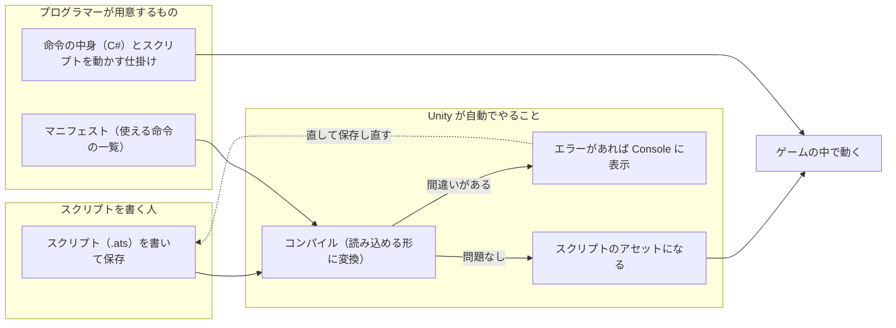

# AtomScript Unity 組み込みマニュアル

Unity のプロジェクトに AtomScript を入れて、イベントスクリプト（`.ats`）を書き、ゲームで動かすまでの手順です。
Unity を初めて触る人でも、上から順に進めれば準備が終わるように書いています。

- 対象：Unity 6000.0.67f1、Windows（64bit）または Mac（Apple Silicon）
- 最終更新：2026-10-08

## 目次

1. [AtomScript とは](#atomscript-とは)
2. [全体の流れ](#全体の流れ)
3. [用意するもの](#用意するもの)
4. [手順 1：Unity をインストールする](#手順-1unity-をインストールする)
5. [手順 2：プロジェクトを作る](#手順-2プロジェクトを作る)
6. [手順 3：AtomScript のパッケージを入れる](#手順-3atomscript-のパッケージを入れる)
7. [手順 4：マニフェストを置く](#手順-4マニフェストを置く)
8. [手順 5：スクリプト（.ats）を書く](#手順-5スクリプトatsを書く)
9. [手順 6：C# の登録コードができていることを確かめる](#手順-6c-の登録コードができていることを確かめる)
10. [プログラマー向け：ゲームからスクリプトを動かす](#プログラマー向けゲームからスクリプトを動かす)
11. [困ったとき](#困ったとき)
12. [用語集](#用語集)
13. [まだ決まっていないこと](#まだ決まっていないこと)

---

## AtomScript とは

ゲームの会話や演出などの「イベント」を、プログラムを書かずに組める仕組みです。
例えば「商人に話しかけたら、メッセージを出して、『はい・いいえ』を選ばせ、答えで分岐する」といった流れを、短いテキスト（拡張子 `.ats`）で書きます。

作業は 2 つの役割に分かれます。このマニュアルのほとんどは「スクリプトを書く人」向けで、最後の 1 節だけがプログラマー向けです。

| 役割 | やること | このマニュアルの節 |
| --- | --- | --- |
| スクリプトを書く人（プランナー・デザイナー） | Unity の準備、`.ats` を書く、エラーを直す | 手順 1〜6 |
| プログラマー | 「メッセージを出す」などの命令（コマンド）をゲームに組み込む、スクリプトを動かす仕掛けを作る | プログラマー向け |

スクリプトで使える命令の一覧は、プロジェクトごとの「マニフェスト」というファイルに書いてあります。マニフェストはプログラマーが用意します。

## 全体の流れ

スクリプトを書く人がやるのは、図の左の「書いて保存する」だけです。そこから先は Unity が自動でやります。



マニフェストが変わったとき（命令が増えた・変わったとき）も、Unity が自動で全部のスクリプトをコンパイルし直します。

## 用意するもの

| もの | 何に使うか | 手に入れ方 |
| --- | --- | --- |
| Unity Hub | Unity 本体を入れたり、プロジェクトを開いたりする窓口のアプリ | Unity の公式サイトから無料でダウンロード（Unity のアカウントが要る） |
| Unity 6000.0.67f1 | ゲームを作るアプリ本体。バージョンはチームで揃える | Unity Hub から入れる（手順 1） |
| AtomScript のパッケージ | Unity に AtomScript を足す部品。`com.pupooh15.atomscript` という名前のフォルダー | プログラマーから受け取る |
| マニフェスト | スクリプトで使える命令・変数の一覧。拡張子 `.atsmanifest.yaml` のファイル | プログラマーから受け取る |
| コマンド一覧（HTML） | マニフェストの中身を、ブラウザーで読める表にしたもの。スクリプトを書くときの辞書 | プログラマーから受け取る |
| Visual Studio Code（任意） | `.ats` を書くためのエディター。AtomScript の拡張機能を入れると、色分け・入力の候補・その場でのエラー表示が使える | 本体は公式サイトから無料。拡張機能（`.vsix`）はプログラマーから受け取る |

「プログラマーから受け取る」ものは、自分で探さずに担当のプログラマーに頼んでください。
メモ帳でも `.ats` は書けますが、エラーにすぐ気づけるので Visual Studio Code をおすすめします。

## 手順 1：Unity をインストールする

すでにチームの Unity プロジェクトがあって、それを開けるなら、手順 1・2 は飛ばして [手順 3](#手順-3atomscript-のパッケージを入れる) へ進んでください。

1. Unity の公式サイトから **Unity Hub** をダウンロードしてインストールする。初めて起動するとサインインを求められるので、Unity のアカウントでサインインする（会社のアカウントがあればそちら）。
2. Unity Hub の左のメニューで **「Installs」** を開き、右上の **「Install Editor」** を押す。
3. 一覧から **6000.0.67f1** を選んで「Install」を押す。
   一覧に無いときは「Archive」タブから Unity 公式サイトのダウンロードアーカイブを開き、同じバージョンの「Unity Hub」ボタンで入れる。
4. 追加するモジュールを聞かれたら、スクリプトを書くだけなら何も選ばなくてよい。
   スマホ向けにビルドする人だけ、「Android Build Support」や「iOS Build Support」にチェックを入れる。
5. インストールが終わるまで待つ（数 GB あるので、数十分かかることがある）。

## 手順 2：プロジェクトを作る

1. Unity Hub の左のメニューで **「Projects」** を開き、右上の **「New project」** を押す。
2. 画面の上の方にある Editor Version が **6000.0.67f1** になっていることを確かめる。違うときは、そこを押して切り替える。
3. テンプレート（ひな形）は「Universal 3D」など、チームに指定されたものを選ぶ。特に指定がなければ何でもよい。
4. 右側で「Project name」（プロジェクト名）と「Location」（保存先のフォルダー）を決めて、**「Create project」** を押す。
5. しばらく待つと、Unity の編集画面（エディター）が開く。

保存先は、**短いパスのフォルダー**（例：`D:\Projects\MyGame`）にしてください。
Windows ではパスが深すぎると、ゲームをビルドしたときに起動できないことがあります。

エディターの画面でよく使う場所は次の 3 つです。

| 名前 | 場所（初期配置） | 役割 |
| --- | --- | --- |
| Project ウィンドウ | 下の方 | プロジェクトのファイル一覧。`Assets` フォルダーに自分のファイルを置く |
| Console ウィンドウ | 下の方（Project の隣のタブ） | エラーやお知らせが出る場所。見当たらないときはメニューの「Window → General → Console」 |
| Inspector ウィンドウ | 右側 | 選んだものの詳しい情報を見る場所 |

## 手順 3：AtomScript のパッケージを入れる

プログラマーから受け取った `com.pupooh15.atomscript` フォルダーを、プロジェクトに入れます。

1. Unity を閉じる（開いたままでもよいが、閉じておくと確実）。
2. エクスプローラー（Mac は Finder）で、作ったプロジェクトのフォルダーを開く。中に `Assets`・`Packages`・`ProjectSettings` などのフォルダーがある。
3. **`Packages` フォルダーの中に、`com.pupooh15.atomscript` フォルダーを丸ごとコピーする。**
   コピー後は `<プロジェクト>/Packages/com.pupooh15.atomscript/package.json` という並びになっていれば正しい。
4. Unity Hub からプロジェクトを開く。

うまく入ったかは、次の 2 つで確かめます。

- Project ウィンドウの「Packages」の中に **「AtomScript」** がある。
- メニューの **「Edit → Project Settings」**（Mac は「Unity → Settings」の場合もある）を開くと、左の一覧に **「AtomScript」** がある。

> **別の入れ方**：プロジェクトに入れずに、PC の決まった場所に置いたまま使うこともできます。
> メニューの「Window → Package Manager」を開き、左上の「+」→「Install package from disk...」で、フォルダーの中の `package.json` を選びます。
> ただしこの方法では、あとでフォルダーを動かすと読めなくなります。迷ったら上の「Packages にコピー」の方法を使ってください。

## 手順 4：マニフェストを置く

1. Project ウィンドウで `Assets` を右クリックし、「Create → Folder」で **`AtomScript`** というフォルダーを作る（名前は何でもよいが、このマニュアルではこの名前で説明する）。
2. 受け取ったマニフェスト（例：`sample.atsmanifest.yaml`）を、エクスプローラーや Finder から Project ウィンドウの `Assets/AtomScript` にドラッグ＆ドロップする。
3. メニューの「Edit → Project Settings」を開き、左の一覧で **「AtomScript」** を選ぶ。
4. 「マニフェスト」の欄に、青い枠で **「使用中：Assets/AtomScript/sample.atsmanifest.yaml」** と出ていれば完了。

マニフェストがプロジェクトに 1 つしかなければ、このように自動で見つけてくれます。

赤い枠でエラーが出ているときは、次のどちらかです。

| 赤い枠の内容 | 対処 |
| --- | --- |
| 「マニフェスト（*.atsmanifest.yaml）が Assets にありません」 | 手順 4 の 2 でファイルが置けていない。置いた場所と拡張子（`.atsmanifest.yaml`）を確かめる |
| 「マニフェストが複数あります」 | 「パス」の右の **「選択…」** を押して、使うマニフェストを選ぶ |

同じ画面には、ほかにも設定があります。普段は触らなくて大丈夫です。

| 設定 | 内容 |
| --- | --- |
| コンパイラ（atsc）のパス | 空のままでよい（パッケージに入っているものを使う） |
| C# の登録コード：自動で生成 | オンのままにしておく（手順 6 で使う） |
| 出力先・名前空間 | プログラマーに指定されたときだけ変える |
| すべての .ats を再インポート | スクリプトの変換をやり直したいときに押す |

## 手順 5：スクリプト（.ats）を書く

### ファイルを作る

Unity には `.ats` を新しく作るメニューが無いので、エクスプローラーや Finder、Visual Studio Code で作ります。

1. Project ウィンドウで `Assets/AtomScript` フォルダーを右クリックし、**「Show in Explorer」**（Mac は「Reveal in Finder」）を選ぶ。
2. 開いたフォルダーの中に、テキストファイルを新しく作り、名前を **`merchant.ats`** にする（拡張子まで `.ats` に変える。`.txt` が残らないように注意）。
3. Visual Studio Code（またはメモ帳）で開いて、次のように書く。文字コードは **UTF-8** で保存する。

```
script "sample/merchant"            // スクリプトID（必ず 1 行目に書く。あとから変えない）

// 商人に話しかけたとき
event OnTalk(target: handle) {
    await ShowMessage("いらっしゃい！", face: Face.Smile)

    let answer = await SelectWindow(SelectType.YesNo)
    if (answer == 0) {
        await ShowMessage("まいどあり！")
    } else {
        await ShowMessage("また来てくれ。")
    }
}
```

書き方のポイントです。

- 1 行目の `script "…"` は **スクリプトID** です。セーブデータがこの名前でスクリプトを見分けるので、ほかのスクリプトと重ならない名前にし、**一度決めたら変えません**。
- `ShowMessage` や `SelectWindow` のような命令の名前と引数は、プログラマーから受け取ったコマンド一覧（HTML）に載っています。
- 表示が終わるまで待つ命令（「待機あり」と書かれた命令）には、前に `await` を付けます。
- `//` から行の終わりまではメモ（コメント）で、動作には関係しません。
- 細かい文法は [docs/language.md](language.md) にまとまっています。

### 保存して確かめる

1. ファイルを保存して、Unity の画面に戻る。
2. Unity が自動で変換（コンパイル）する。数秒で終わる。
3. Project ウィンドウに `merchant` が表示されれば成功。選ぶと、Inspector に `Script Id`（スクリプトID）などが表示される。

書き直したときも、保存して Unity に戻るだけで変換し直されます。

### エラーの見方

書き方に間違いがあると、Console ウィンドウに赤い文字でエラーが出ます。

```
Assets/AtomScript/merchant.ats(5,5): error: 'ShowMesage' は関数・コマンド・クエリのどれでもありません
```

| 部分 | 意味 |
| --- | --- |
| `Assets/AtomScript/merchant.ats` | 間違いのあるファイル |
| `(5,5)` | 5 行目の、左から 5 文字目（間違いのある文の書き出しの位置。この例では `await` の位置） |
| `error:` の後ろ | 何が間違っているか（この例では `ShowMessage` のつづりが違う） |

間違いを直して保存し直せば、エラーは消えます。エラーがある間は、そのスクリプトはゲームで使えません（古い内容が残ることもありません）。

よくあるエラーです。

| エラーの内容 | よくある原因 |
| --- | --- |
| 「〜は関数・コマンド・クエリのどれでもありません」 | 命令の名前のつづり間違い。大文字・小文字も区別される |
| `await` が要る・要らないというエラー | 「待機あり」の命令に `await` を付け忘れた、または待機なしの命令に付けた |
| 括弧やカッコの対応のエラー | `{` と `}`、`(` と `)` の数が合っていない |
| 文字化けしたエラー | ファイルが UTF-8 で保存されていない |

Visual Studio Code に AtomScript の拡張機能を入れていれば、同じエラーが Unity に戻る前に、エディターの中で波線として表示されます。

## 手順 6：C# の登録コードができていることを確かめる

AtomScript は、マニフェストからプログラマーが使う C# のファイル（登録コード）を自動で作ります。
スクリプトを書く人がこのファイルを触ることはありませんが、できているかだけ確かめておきます。

1. Project ウィンドウで `Assets/AtomScript/Generated` フォルダーを開く。
2. マニフェストの `project` の名前をもとにしたファイル（例：`SampleRpg.g.cs`）があれば完了。

このファイルは**手で編集しません**。マニフェストが変わるたびに、自動で作り直されます。
自動で作られないときは、メニューの **「Assets → AtomScript → C# を生成」** で作れます。

---

## プログラマー向け：ゲームからスクリプトを動かす

ここからはプログラマー向けです。手順 6 でできた登録コード（例：`SampleRpg.g.cs`）を使います。

### 1. 命令（コマンド）を実装する

登録コードには、マニフェストのコマンドごとのメソッドを持つ interface（`ISampleRpgCommands` など）が入っています。これを実装します。MonoBehaviour でも普通のクラスでも構いません。

- 即時コマンド・クエリ：引数を受け取り、値を返す。
- 待機ありコマンド：`Awaitable`（結果があれば `Awaitable<T>`）を返す。終わると自動でスクリプトが先へ進む。
  ファイバが中断されると（`AbortFiber`・`race`・VM の破棄）`ct` がキャンセルされる。例外を投げるとコマンドの失敗になる。
- マニフェストのコマンドを足したり引数を変えたりすると、登録コードが作り直され、実装漏れがコンパイルエラーになる。

### 2. スクリプトを動かす仕掛けを作る

最小の例です。シーンの GameObject に付け、Inspector の `Merchant Script` に手順 5 の `merchant` をドラッグ＆ドロップします。

```csharp
using System.Threading;
using AtomScript;
using SampleRpg;			// 登録コードの名前空間（マニフェストの project を PascalCase にしたもの）
using UnityEngine;

public class ScriptManager : MonoBehaviour, ISampleRpgCommands
{
	[SerializeField] AtsScriptAsset merchantScript;		// インポートした .ats

	ScriptRuntime	runtime;
	ScriptProgram	program;
	ScriptVM		vm;

	void Awake()
	{
		runtime = new ScriptRuntime();						// アプリ全体で 1 つ
		Registration.Register( runtime, this );				// 共有変数とコマンドを登録
		program = runtime.LoadProgram( merchantScript );
		vm = runtime.CreateVM();
		AtomScriptLoop.Register( vm );						// 毎フレーム自動で更新する
	}

	void OnDestroy()
	{
		vm?.Dispose();				// 待機中のコマンドにはキャンセルが届く
		program?.Dispose();
		runtime?.Dispose();
	}

	// ゲーム側から呼ぶ：商人に話しかけた
	public void Talk() => Events.FireOnTalk( vm, program, AtsHandle.None );

	//---------------------------------------------------------------------
	// コマンドの実装
	//---------------------------------------------------------------------
	public async Awaitable ShowMessage( string text, Face face, CancellationToken ct )
	{
		Debug.Log( $"[{face}] {text}" );
		await Awaitable.WaitForSecondsAsync( 1.0f, ct );		// 本来はメッセージウィンドウを出して、閉じるまで待つ
	}

	public async Awaitable<int> SelectWindow( SelectType type, CancellationToken ct )
	{
		await Awaitable.NextFrameAsync( ct );					// 本来は選択肢を出して、選ばれるまで待つ
		return 0;
	}

	public void CameraShake( float power, float duration ) {}
	public Awaitable FadeOut( float time, CancellationToken ct ) => Awaitable.WaitForSecondsAsync( time, ct );
	public Awaitable PlayBgm( string name, CancellationToken ct ) => Awaitable.NextFrameAsync( ct );
	public bool IsQuestCleared( int questId ) => false;
}
```

### 3. よく使う API

| やりたいこと | 書き方 |
| --- | --- |
| 共有変数を読む・書く | `vm.Get( Vars.Story.Chapter )` / `vm.Set( Vars.Story.Chapter, 3 )` |
| イベントを起こす | `Events.FireOnTalk( vm, program, target )`（戻り値の `FiberId` で中断や状態の確認ができる） |
| 同名のイベントを全スクリプトに送る | `Events.BroadcastOnTalk( vm, target )` |
| 実行中のイベントを止める | `vm.AbortFiber( fiber )` |
| セーブ・ロード | `byte[] data = vm.Save()` / `vm.Load( data )`（保存されるのは変数と乱数だけ。実行中のイベントは保存しない） |
| アクターを handle で渡す | `HandleTable<T>` に登録して `AtsHandle` を受け渡す |
| ログの出し先を変える | `runtime.Log = ( level, message ) => …` |

詳しい取り決めは仕様書 [docs/spec.md](spec.md) の §9 にあります。

### 4. ビルドするときの注意

| 対象 | 注意 |
| --- | --- |
| Windows・macOS | パッケージに入っているビルド済みのネイティブプラグインを使う。追加の作業は無い |
| Android・iOS・家庭用機 | **Scripting Backend を IL2CPP にする**（Project Settings → Player → Other Settings）。コアのソースが IL2CPP でゲームと一緒にコンパイルされる。Mono には対応していない |
| Windows でビルドする場合 | プロジェクトのパスを短くする（深いと、ビルドしたゲームが起動しないことがある） |

---

## 困ったとき

| 症状 | 原因と対処 |
| --- | --- |
| Project Settings に「AtomScript」が無い | パッケージが入っていない。手順 3 で `Packages/com.pupooh15.atomscript/package.json` の並びになっているか確かめる |
| 「マニフェストが見つかりません」「マニフェストが複数あります」 | [手順 4](#手順-4マニフェストを置く) の表のとおりに直す |
| 「パッケージに atsc がありません」 | 受け取ったパッケージに、変換用のツールが入っていない。プログラマーに「ツール入りのパッケージ」を頼む |
| `.ats` を直したのに反映されない | Unity の画面をいったん別のアプリに切り替えて戻る。それでもだめなら `.ats` を右クリック →「Reimport」、または Project Settings → AtomScript →「すべての .ats を再インポート」 |
| `.ats` が Project ウィンドウに出てこない | 拡張子が `.ats.txt` になっている可能性がある。エクスプローラーの「表示 → ファイル名拡張子」をオンにして確かめる |
| マニフェストを変えたら C# のエラーが出た | 命令が増えた・変わったため、プログラマーの実装が足りなくなっている。正常な動きなので、プログラマーに伝える |
| ゲームを動かすと `DllNotFoundException: atomscript` | パッケージに Unity 用のネイティブプラグインが入っていない。プログラマーに頼む |
| Mac で「開発元を検証できないため開けません」 | ダウンロードしたパッケージに macOS の安全のための印が付いている。プログラマーに伝える（ターミナルで `xattr -dr com.apple.quarantine <パッケージのフォルダー>` を実行すると外せる） |
| Android でビルドしたゲームがすぐ落ちる | Scripting Backend が Mono になっている。IL2CPP に変える |

## 用語集

| 用語 | 意味 |
| --- | --- |
| スクリプト（`.ats`） | イベントの流れを書いたテキストファイル |
| スクリプトID | `.ats` の 1 行目の `script "…"`。セーブデータがスクリプトを見分ける名前なので変えない |
| マニフェスト（`.atsmanifest.yaml`） | スクリプトで使える命令・変数・選択肢（enum）の一覧。プログラマーが管理する |
| コマンド | スクリプトから呼ぶ命令（メッセージを出す、BGM を鳴らす など） |
| 待機ありコマンド | 終わるまで次へ進まないコマンド。呼ぶときに `await` を付ける |
| クエリ | 値を問い合わせるだけの命令（クエストをクリアしたか など） |
| イベント | スクリプトの入口。ゲームから「話しかけた」などのきっかけで始まる |
| 共有変数 | マニフェストで決めた、全スクリプトとゲームで共有する値（章の番号、フラグなど） |
| コンパイル | `.ats` を、ゲームが読める形（`.atsb`）に変換すること。Unity が自動でやる |
| 登録コード | マニフェストから自動で作られる C# のファイル。プログラマーが使う |
| パッケージ | Unity に機能を足す部品のまとまり |
| IL2CPP | Unity のビルド方式の 1 つ。スマホや家庭用機では必ずこれを使う |

## まだ決まっていないこと

| 項目 | 今の状態 |
| --- | --- |
| パッケージ名 | `com.pupooh15.atomscript` は仮の名前。決まったら変わる |
| パッケージの配り方 | 今はプログラマーがビルドしたフォルダーを渡している。配布方法は未定 |
| Android・iOS・家庭用機での動作 | Android は APK のビルドまで確認済み、実機は未確認。iOS・家庭用機は未確認 |
| macOS の署名 | 未対応。配り方が決まったら判断する |
